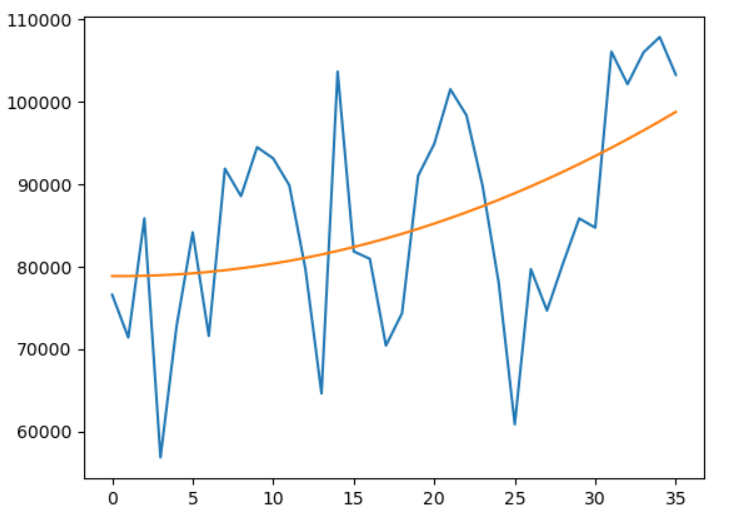

# findbillion   
findbillion想利用統計和AI等方法估算目標價, 以價值型分析為主  
之前的版本大多用matlab和C#做演算法開發 
這個版本重寫優化演算法並大量驗證, 嘗試優化準確度, 並且開源 
 
舊的桌機版可在此處下載 http://www.findbillion.com  
該演算法從2012年之後就沒有更新 
 
2020/05/22其中一個帳戶績效如下, 累積報酬約150%, 以長線布局為主, 個股大多為2012年之後進場   
 
 
  
 
## 程式碼採用平台如下:  
Python 3.6.10 以上  
  
 
## 目錄結構   
data: 相關的數據與資料, 包括2012~2019年部分資產負債表, 損益表, 現金流量表, 月營收, 除權息資料, 月K線   
findbillion: 資料讀取, 財務比率計算與預估   
analysis: 個股分析, 與全面的分析, 含EPS預估以及現金股利預估  
   
  

## 預估EPS (以2330台積電為例):   
程式碼如analysis/eps/run_est_eps_2330.py  
 
### 方法1: 利用平均稅後盈餘淨利率
台灣上市櫃公司有一個特點就是會每月公布月營收, 於是我們利用月營收資訊預估EPS   
預估EPS = (平均近4季的稅後盈餘淨利率 x 近12個月的月營收)/股本    

以預估台積電2013~2019年的EPS為例, 預估誤差都在5%以下

|  年份  |	2013   |	2014  |	2015	  |  2016	|  2017 |	2018	 | 2019   |
| -------| ------| ------ | ------| ------| ------| ------| ------ |
| 正確值 |	7.26  |	10.18  | 11.82 |	12.89 |	13.23 |	13.54 |	13.32  |
| 預測值 |	7.2	  |  9.72  |	11.84 |	12.56 |	13.41 |	13.64 |	12.87  |
| 誤差	  | 0.48% |	-4.49% |	0.17% |	-2.53 |	1.37% |	0.73% |	-3.34% |

  

### 方法2: (建構中)
 
 

## 預估現金股利 (以2330台積電為例):   
程式碼如analysis/yield/run_est_yield_2330.py  

### 方法1: 過去5年平均股利
這是市面上最多人採用的方法, 存股常見的方法  
以台積電為例, 2013~2017年股利如下
    

(圖表來源: 財報狗) 
 
2018年發佈股利: 8.00元  
過去五年平均股利: 5.70元  
**預估誤差: -28.75%**   
**用過去5年平均股利的方法在公司成長時會低估, 公司衰退時會高估**  
 

### 方法2: 預估EPS+平均過去5年配息率  
公司的配息率比較固定, 因此可以使用平均配息率做預估  
加上前面EPS預估的方法可推估現金配息  
 
2018年發佈股利: 8.00元  
過去五年平均股利:  6.48元  
**預估誤差: -19.03%**  
**相較方法1, 誤差有較縮小, 但誤差還是不低** 
 
### 方法3: 預估EPS+預估配息率  
因為EPS變高時, 通常會提高配息率, 因此建立一簡單回歸模型做配息率的預估
2018年發佈股利: 8.00元  
過去五年平均股利: 7.86元  
**預估誤差: -1.71%**  
**預估的誤差值跟前面方法相比大幅減少**  
 

## 預估EPS (2013~2019年的個股驗證):   
程式碼如analysis/eps/run_est_eps.py  
結果如result目錄下   
 

### 方法1: 利用平均稅後盈餘淨利率 (全部個股) 
預估EPS = 平均近4季的稅後盈餘淨利率 x 近12個月的月營收    
驗證2013~2019, **EPS預測+-10%內比例大約在35%上下, 並不高**  

|  年份            | 2013   |  2014  |  2015  |  2016  |  2017  |  2018  |  2019  |
| ---------------- | ------ | ------ | ------ | ------ | ------ | ------ | ------ |
| 誤差+-10%內比例   | 35.16% | 39.06% | 37.76% | 35.73% | 34.49% | 35.83% | 36.24% |

 

### 方法1: 利用平均稅後盈餘淨利率 (過去五年平均ROE>15%) 
加入ROE>15%的條件  
驗證2013~2019, **EPS預測+-10%內比例大約在60%上下**   
**ROE>15%的個股預估較為準確**

|  年份            | 2013   |  2014  |  2015  |  2016  |  2017  |  2018  |  2019  |
| ---------------- | ------ | ------ | ------ | ------ | ------ | ------ | ------ |
| 誤差+-10%內比例   | 60.84% | 64.11% | 62.38% | 63.36% | 58.07% | 65.53% | 66.21% |

 

## 預估現金股利 (2012~2018年的個股驗證):   
程式碼如analysis/yield/run_est_yield.py    

### 方法1: 過去5年平均股利 (過去五年平均ROE>15%)   
驗證2013~2018, **現金股利預測+-20%內比例大約在30%上下, 並不高**  

|  年份            | 2013   |  2014  |  2015  |  2016  |  2017  |  2018  |
| ---------------- | ------ | ------ | ------ | ------ | ------ | ------ |
| 誤差+-10%內比例   | 34.26% | 30.83% | 28.22% | 33.73% | 36.02% | 40.17% |

 

### 方法2: 預估EPS+平均過去5年配息率 (過去五年平均ROE>15%)  
驗證2013~2018, **現金股利預測+-20%內比例大約在35-40%左右, 稍微提升, 但也並不高**  

|  年份            | 2013   |  2014  |  2015  |  2016  |  2017  |  2018  |
| ---------------- | ------ | ------ | ------ | ------ | ------ | ------ |
| 誤差+-10%內比例   | 34.66% | 36.25% | 36.30% | 41.30% | 42.98% | 40.79% |

 

### 方法3: 預估EPS+預估配息率 (過去五年平均ROE>15%)  
驗證2013~2018, **現金股利預測+-20%內比例大約在50-65%左右, 跟前面的方法相比大幅提升**  

|  年份            | 2013   |  2014  |  2015  |  2016  |  2017  |  2018  |
| ---------------- | ------ | ------ | ------ | ------ | ------ | ------ |
| 誤差+-10%內比例   | 51.39% | 56.30% | 62.23% | 60.89% | 56.84% | 65.49% |

### 方法4: 預估EPS+預估配息率 (過去五年平均ROE>15% + 過去八季自由現金流量為正)  
驗證2013~2018, **現金股利預測+-20%內比例大約在55-70%左右, 跟前面的方法提升大約5%的準確度**  

|  年份            | 2013   |  2014  |  2015  |  2016  |  2017  |  2018  |
| ---------------- | ------ | ------ | ------ | ------ | ------ | ------ |
| 誤差+-10%內比例   | 56.41% | 61.20% | 68.75% | 66.15% | 59.69% | 70.49% |

 
跟市面上最常見的方法1: 過去5年平均股利相比, 提升20%~30%的準確度
 
 

## 比較現金股利持股績效 (2012~2018年的個股驗證):   
程式碼如analysis/yield/run_est_return.py    
比較上述    
方法1: 過去5年平均股利 (過去五年平均ROE>15)     
以及    
方法4: 預估EPS+預估配息率 (過去五年平均ROE>15% + 過去八季自由現金流量為正)    
以及    
方法0: 單純從ROE>15之中任意選股  
的方式做比較  
假設每年1月公布營收時, 選擇現金殖利率>6.25%的個股, 於1月最高點買進, 持有三年後的報酬率, 任選其中十檔的平均報酬及95%信賴區間如下    

任選十檔持有三年後的平均報酬率  
|  年份                      | 2014~2016(預估2013) | 2015~2017(預估2014) | 2016~2018(預估2015) | 2017~2019(預估2016) | 
| -------------------------- | ------ | ------ | ------ | ------ | 
| 方法0: 任意選股             | 2.06% | 10.16% | 19.44% | 22.82% | 
| 方法1: 過去5年平均股利      | 6.13% | 21.36% | 51.99% | 43.38% | 
| 方法4: 預估EPS+預估配息率   | 9.64% | 25.76% | 37.12% | 36.41% | 

  
任選十檔持有三年後的95%信賴區間  

|  年份                      | 2014~2016(預估2013) | 2015~2017(預估2014) | 2016~2018(預估2015) | 2017~2019(預估2016) | 
| -------------------------- | ------ | ------ | ------ | ------ |
| 方法0: 任意選股             | -5.41%~14.93% | 5.47%~14.86% | 11.84%~25.61% | 17.30%~30.84% |
| 方法1: 過去5年平均股利      | -17.13%~33.21% | 4.69%~41.96% | 29.17%~77.72% | 36.56%~53.89% |
| 方法4: 預估EPS+預估配息率   | -11.14%~46.72% |  4.58%~41.96% | 24.22%~54.35%  | 20.21%~53.88% | 

由分析可見, 透過現金股利的選股, 皆比任意選股績效來的好   
方法4: 預估EPS+預估配息率並沒有比方法1: 過去5年平均股利來的好, 主要原因是因為雖然成長性的股票會低估, 但是很難持久  
 
若將持股拉高到30檔, 與0056高股息ETF做比較  
|  年份                      | 2014~2016 | 2015~2017 | 2016~2018 | 2017~2019 | 
| -------------------------- | ------ | ------ | ------ | ------ | 
| 0056高股息ETF              | 15.59% | 23.99% | 36.63% | 40.20% |
| 方法0: 任意選股            | 3.36% | 12.32% | 17.04% | 23.04% |
| 方法1: 過去5年平均股利      | 4.70% | 22.58% | 45.34% | 41.34% | 
| 方法4: 預估EPS+預估配息率   | 24.21% | 27.24% | 36.59% | 35.19% | 

結果發現, 方法1及方法4和0056高股息ETF績效互有領先, 相去不遠, 都遠比任意選股來的好   
所以在沒有大量分析的情況下, 買0056是很棒的選擇  
  
 

## 計算營收成長率 (以2330台積電為例):   
我們利用2次回歸去求得營收成長率, 以2330為例, 將2017/1~2019/12營收做回歸, 推得成長如下圖  
  
並利用微分求得YoY成長率為14.26%

## 加入營收成長率後比較現金股利持股績效 (2012~2018年的個股驗證):   
承上面的分析, 新增方法5: 方法4 + 營收成長率>0% 

任選十檔持有三年後的平均報酬率  
|  年份                                   | 2014~2016(預估2013) | 2015~2017(預估2014) | 2016~2018(預估2015) | 2017~2019(預估2016) | 
| ----------------------------------------| ------ | ------ | ------ | ------ | 
| 方法0: 任意選股                          | 2.06% | 10.16% | 19.44% | 22.82% | 
| 方法1: 過去5年平均股利                   | 6.13% | 21.36% | 51.99% | 43.38% | 
| 方法4: 預估EPS+預估配息率                | 9.64% | 25.76% | 37.12% | 36.41% | 
| 方法5: 預估EPS+預估配息率+營收成長率>0%   | 23.56% | 24.30% | 55.54% | 26.75% | 

  
任選十檔持有三年後的95%信賴區間  

|  年份                                   | 2014~2016(預估2013) | 2015~2017(預估2014) | 2016~2018(預估2015) | 2017~2019(預估2016) | 
| --------------------------------------  | ------ | ------ | ------ | ------ |
| 方法0: 任意選股                          | -5.41%~14.93% | 5.47%~14.86% | 11.84%~25.61% | 17.30%~30.84% |
| 方法1: 過去5年平均股利                   | -17.13%~33.21% | 4.69%~41.96% | 29.17%~77.72% | 36.56%~53.89% |
| 方法4: 預估EPS+預估配息率                | -11.14%~46.72% |  4.58%~41.96% | 24.22%~54.35%  | 20.21%~53.88% | 
| 方法5: 預估EPS+預估配息率+營收成長率>0%   | -10.91%~69.05% |  7.93%~41.60% | 16.48%~102.83%  | -0.51%~48.71% | 

由分析可見, 方法5在大部分的時間都有不錯的表現, 尤其在績效最差的2014~2016年改善幅度最大, 但在2017~2019的績效較差, 原因是2017~2019可選擇的價值型的股票並不多   
 
若將持股拉高到30檔, 與0056高股息ETF做比較  
|  年份                      | 2014~2016 | 2015~2017 | 2016~2018 | 2017~2019 | 
| -------------------------- | ------ | ------ | ------ | ------ | 
| 0056高股息ETF              | 15.59% | 23.99% | 36.63% | 40.20% |
| 方法0: 任意選股            | 3.36% | 12.32% | 17.04% | 23.04% |
| 方法1: 過去5年平均股利      | 4.70% | 22.58% | 45.34% | 41.34% | 
| 方法4: 預估EPS+預估配息率   | 22.73% | 28.13% | 42.01% | 29.70% | 

從分析也可以看出, 在大部分的區間績效皆比0056高股息ETF來的好, 在2017~2019的績效較差, 原因是2017~2019可選擇的價值型的股票並不多

備註:  
1. 資料僅供參考不做任何獲利保證及特定股票跟點位推薦建議 
2. 資料並不完整, 需要完整資料請至公開資訊觀測站 
3. 無論任何股市數據分析皆存在倖存者偏差 
